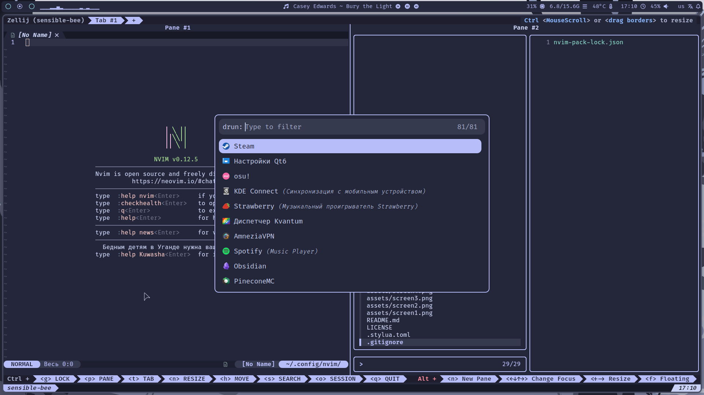
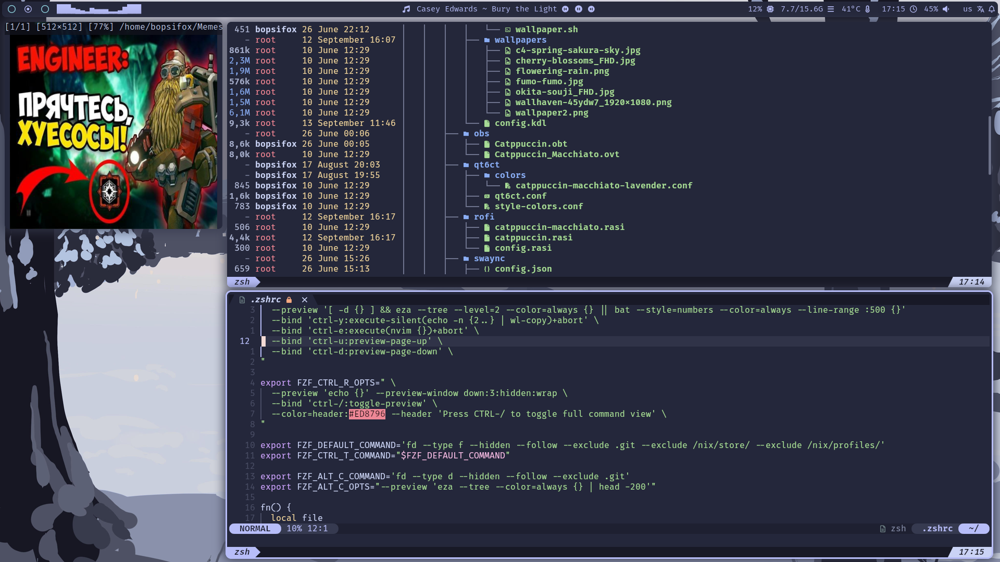
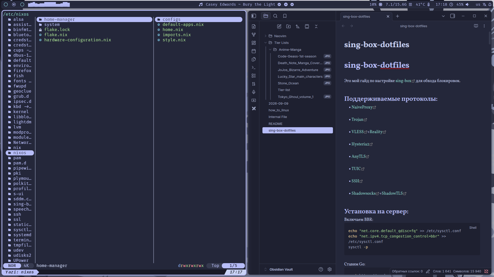
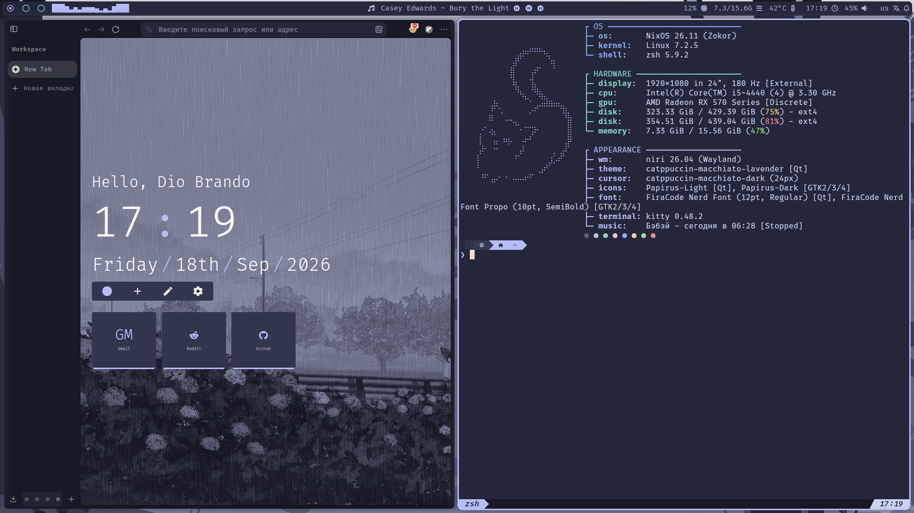

# Violet-dots
My goal was to use a single color scheme for the entire system.
---

  
  
  
  

---
### 🛠️ Tech Stack
---
🪟 **Compositor:** [Niri](https://github.com/YaLTeR/niri)

🐚 **Shell:** [Zsh](https://www.zsh.org/)

📂 **File Manager:** [Yazi](https://github.com/sxyazi/yazi) & [Dolphin](https://apps.kde.org/dolphin/)

💻 **Terminal:** [Kitty](https://sw.kovidgoyal.net/kitty/)

📊 **Bar:** [Waybar](https://github.com/Alexays/Waybar)

🚀 **Application Launcher:** [Rofi](https://github.com/davatorium/rofi)

